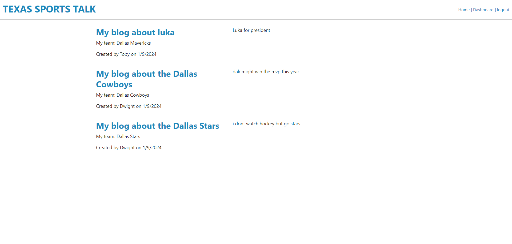

  # BlogPage README.md
  

  ## Description

  This project is a functional blog that allows users to log in and have personal blogs that they can create. Users are also able to delete their blogs and comment on other users blogs 

  ## Table Of Contents 

  * [Installation](#Installation)

  * [Usage](#usage)
  
  * [License](#license)

  * [Contributing](#contributing)

  * [Tests](#tests)

  * [Questions](#questions)

  ## Installation

  To install necessary dependencies, run the following command:

  npm i

  ## Usage

  The use of this project is to allow users to have a blog that they can talk about anything that they want. Users are able to interact with other blog posts and share there thoughts about other peoples blogs

  ## License

  This project is licensed under the No license 

  ## Contributing 

  Send a request

  ## Tests

  To run tests run the following command:

  npm run test

  ## Questions

  if you have any questions about the repo, Please feel free to open a issue or contact me directly at terrencemccarthysnkrs@gmail.com
  You can find more of my work at https://github.com/Tmysterz

  ## Github link

  [Github](https://github.com/Tmysterz/blogPost)

  ## Screenshot

 

 ## Deployed application

 [blogPage](https://serene-eyrie-53750-eea6dabed72d.herokuapp.com/)